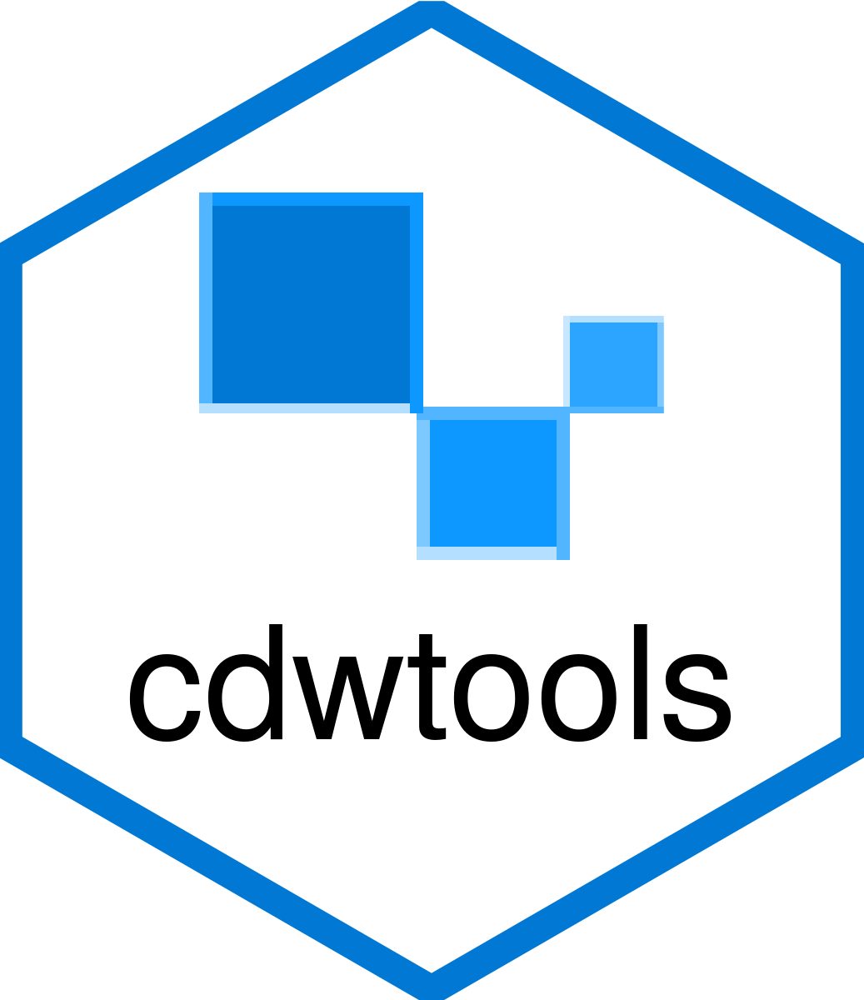

<!-- README.md is generated from README.Rmd. Please edit that file -->
<!--# cdwtools <a href="https://borisdelange.github.io/cdwtools/index.html"></a>-->
<!-- badges: start -->

[](https://lifecycle.r-lib.org/articles/stages.html#experimental)
<!-- badges: end -->

## Overview

cdwtools stands for **Clinical Data Warehouse tools**. This package aims
to help clinicians, statisticians & data scientists work with CDW data,
with data visualization, data cleaning, exploratory data analysis &
model building tools, using a **Shiny web application**.


<br /> For your **first connection**, [follow this
guide](https://borisdelange.github.io/cdwtools/articles/cdwtools.html).

The application contains a **data management section**, which allows the
import of datamarts & thesaurus, the creation of studies & subsets. You
choose who has access to which part of the app in the **users management
section**.

The core principle of the app is the **modularity** : each user chooses
:

-   which pages to display, called **modules** in the app,
    *Haemodynamics* or *Respiratory* modules in the above screenshot
-   which **figures** to display in each page : a timeline ? a text area
    ?
-   which **thesaurus items** each figure uses

You can customize two main pages :

-   **patient-level data page**, where you explore data patient by
    patient
-   **aggregated data page**, where you manipulate aggregated data, with
    data cleaning, EDA…

The app contains two sides :

-   a **user side**, which requires no particular skill in R
-   a **developper side**, where new plugins can be developped

A **plugin** is a Shiny code used to render and manipulate data. Some
plugins are available in the **Articles section** of this website. You
can **create new plugins** and share them.

## Installation

<!--You can install the released version of cdwtools from [CRAN](https://CRAN.R-project.org) with:

``` r
install.packages("cdwtools")
```
-->

You can install the development version from Github, with :

``` r
remotes::install_github("BorisDelange/cdwtools")
```

## Deployment

The App can be deployed **locally** or installed on a **server**. See
*Deploy the App on ShinyProxy* in Articles section for more details.

## Security

The App uses [Shiny
Manager](https://github.com/datastorm-open/shinymanager) to secure the
access. In the developper mode, you have direct access to the R
environment and the database, so developper access has to be used
carefully. It is recommended to install the App on a secure local
server, as health data will be handled.

## Development

The app has been developed with the [LTSI lab - DMS
unit](https://www.ltsi.univ-rennes1.fr/) of the university of Rennes -
France, which is behind the [eHOP clinical data
warehouse](https://centrededonneescliniques.univ-rennes1.fr/ehop).
