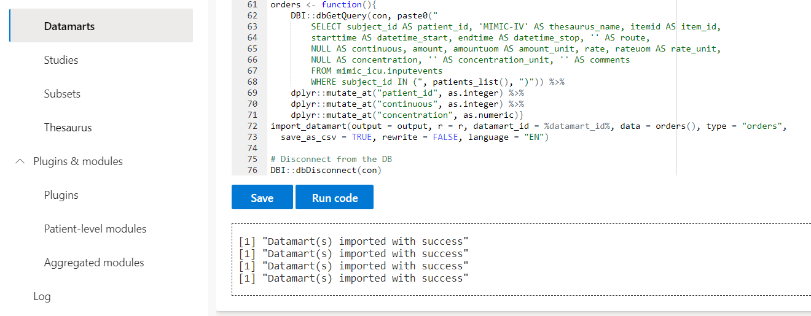
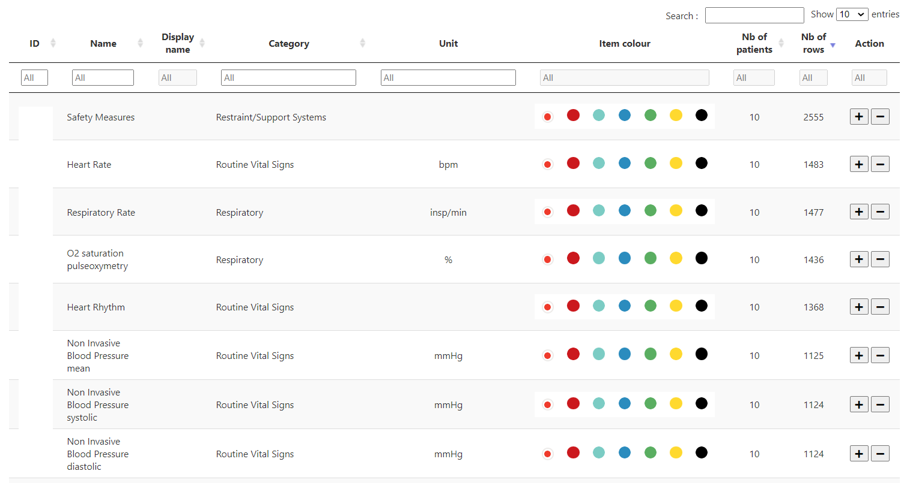

```{r, include = FALSE}
knitr::opts_chunk$set(
  collapse = TRUE,
  comment = "#>"
)
```

> A complete use case with data coming from the <a href="https://mimic.mit.edu/" target="_blank">MIMIC-IV database</a>.

## Ask access to MIMIC-IV data

To have access to the MIMIC-IV database, <a href="https://physionet.org/content/mimiciv/1.0/" target="_blank">click on this link</a> and go on the bottom of the page.

You have to :

- <a href="https://physionet.org/settings/credentialing/" target="_blank">Create an account here</a>
- <a href="https://physionet.org/sign-dua/mimiciv/1.0/" target="_blank">Sign the data use agreement</a>

You can see database's <a href="https://mimic.mit.edu/docs/iv/modules/core/admissions/" target="_blank">tables structure here</a>.

## Launch the app

In RStudio, run the Shiny application with :

```r
app_db_folder <- "C:/Users/John/My cdwtools project"
datamarts_folder <- "C:/Users/John/My cdwtools project/data"
cdwtools::cdwtools(language = "EN", app_db_folder = app_db_folder, datamarts_folder = datamarts_folder)
```

See <a href="https://borisdelange.github.io/cdwtools/articles/cdwtools.html " target="_blank">Get started</a> page for more informations about `app_db_folder  &`datamarts_folder` arguments.

## Data source & datamart

First, create a *Data source* called *MIMIC-IV* in Settings/Data management/Data sources.

```{r, echo = FALSE}
knitr::include_graphics("../man/figures/mimic_iv_tutorial/EN_create_data_source.png")
```

Then, create a *Datamart* called *MIMIC-IV tutorial datamart*. By default, everybody has access to this datamart. You can **change the visibility** of this datamart on Datamarts management > Settings (on the Action column) > Grant access to.

**Edit the code** of your datamart (Datamarts management > Edit code (on the Action column)), enter this code, after having modified `dbConnect` informations.

First, let's import **patients data** (from table <strong><a href="https://mimic.mit.edu/docs/iv/modules/core/patients/" target="_blank">patients</a></strong>).  
See `import_datamart` documentation to know which columns & which data type is required (`?import_datamart`).
Let's select only 10 patients.

```r
# Connection to the database, from where we extract data
con <- DBI::dbConnect(RPostgres::Postgres(), dbname = "mimic-iv", host = "localhost",
  port = 5432, user = "admin", password = "admin")

# Create a patients function which, when executed, gets patients data
patients <- function(){
    DBI::dbGetQuery(con, paste0(
        "SELECT icu.subject_id AS patient_id, p.gender, p.anchor_age AS age, p.dod
        FROM mimic_icu.icustays icu 
        INNER JOIN mimic_core.patients p ON icu.subject_id = p.subject_id
        LIMIT 10")) %>%
    dplyr::mutate_at("patient_id", as.integer) %>%
    dplyr::mutate_at("dod", lubridate::ymd_hms)}

# Run import_datamart function, with patients function as data argument
import_datamart(output = output, r = r, datamart_id = %datamart_id%, data = patients(), type = "patients", 
  save_as_csv = TRUE, rewrite = FALSE, language = "EN")

# Create a patients_list function, which facilitates next SQL queries
patients_list <- function() paste(patients() %>% dplyr::pull(patient_id), collapse = ",")

# Disconnect from the DB
DBI::dbDisconnect(con)
```

**Error messages** are printed in the box below the editor.

If you want to check the data before running `import_datamart`, you can print it in the console with :

```r
con <- DBI::dbConnect(RPostgres::Postgres(), dbname = "mimic-iv", host = "localhost",
  port = 5432, user = "admin", password = "admin")
patients <- function(){
    DBI::dbGetQuery(con, paste0("SELECT * FROM mimic_core.patients p LIMIT 10")) %>%
    dplyr::select(patient_id = subject_id, gender, age = anchor_age, dod)}

# Show the dataframe
print(patients())

DBI::dbDisconnect(con)
```

We then create **stays data**, containing informations on distinct hospital stays (from table <strong><a href="https://mimic.mit.edu/docs/iv/modules/core/admissions/" target="_blank">admissions</a></strong>).

```r
con <- DBI::dbConnect(RPostgres::Postgres(), dbname = "mimic-iv", host = "localhost",
  port = 5432, user = "admin", password = "admin")

# Create a stays function & import this data
stays <- function(){
    DBI::dbGetQuery(con, paste0("
        SELECT subject_id AS patient_id, hadm_id AS stay_id, 'Random unit' AS unit_name, 
        admittime AS admission_datetime, dischtime AS discharge_datetime
        FROM mimic_core.admissions 
        WHERE subject_id IN (", patients_list(), ")")) %>%
    dplyr::mutate_at("patient_id", as.integer)}

import_datamart(output = output, r = r, datamart_id = %datamart_id%, data = stays(), type = "stays",
  save_as_csv = TRUE, rewrite = FALSE, language = "EN")

DBI::dbDisconnect(con)
```

Import **labs_vitals**, containing labs data (from <strong><a href="https://mimic.mit.edu/docs/iv/modules/hosp/labevents/" target="_blank">labevents</a></strong> table), vitals (from <strong><a href="https://mimic.mit.edu/docs/iv/modules/icu/chartevents/" target="_blank">chartevents</a></strong>) table) and other informations like output events (table <strong><a href="https://mimic.mit.edu/docs/iv/modules/icu/outputevents/" target="_blank">outputevents</a></strong>) & datetime events (table <strong><a href="https://mimic.mit.edu/docs/iv/modules/icu/datetimesevents/" target="_blank">datetimeevents</a></strong>).

```r
con <- DBI::dbConnect(RPostgres::Postgres(), dbname = "mimic-iv", host = "localhost",
  port = 5432, user = "admin", password = "admin")

# Do the same with labs_vitals data
labs_vitals <- function(){
    DBI::dbGetQuery(con, paste0(
        "SELECT subject_id AS patient_id, 'MIMIC-IV' AS thesaurus_name, itemid AS item_id, 
        charttime AS datetime_start, '' AS datetime_stop, value, valuenum AS value_num, 
        valueuom AS unit, '' AS comments
        FROM mimic_icu.chartevents
        WHERE subject_id IN (", patients_list(), ")
  UNION SELECT subject_id AS patient_id, 'MIMIC-IV' AS thesaurus_name, itemid AS item_id, 
        charttime AS datetime_start, '' AS datetime_stop, value, valuenum AS value_num, 
        valueuom AS unit, '' AS comments
        FROM mimic_hosp.labevents
        WHERE subject_id IN (", patients_list(), ")
  UNION SELECT subject_id AS patient_id, 'MIMIC-IV' AS thesaurus_name, itemid AS item_id, 
        charttime AS datetime_start, '' AS datetime_stop, CAST(value AS VARCHAR(255)) AS value, 
        NULL AS value_num, valueuom AS unit, '' AS comments
        FROM mimic_icu.datetimeevents
        WHERE subject_id IN (", patients_list(), ")
  UNION SELECT subject_id AS patient_id, 'MIMIC-IV' AS thesaurus_name, itemid AS item_id, 
        charttime AS datetime_start, '' AS datetime_stop, '' AS value, value AS value_num, 
        valueuom AS unit, '' AS comments
        FROM mimic_icu.outputevents
        WHERE subject_id IN (", patients_list(), ")
        ")) %>%
    dplyr::mutate_at("patient_id", as.integer) %>%
    dplyr::mutate_at("value", as.character) %>%
    dplyr::mutate_at("value_num", as.numeric) %>%
    dplyr::mutate_at("datetime_stop", lubridate::ymd_hms)}

import_datamart(output = output, r = r, datamart_id = %datamart_id%, data = labs_vitals(), 
  type = "labs_vitals", save_as_csv = TRUE, rewrite = FALSE, language = "EN")

DBI::dbDisconnect(con)
```

For now, we do not have access to clinical notes from the MIMIC-IV database, we **do not import text data**.

Finally, let's import **orders data** (we use only table <strong><a href="https://mimic.mit.edu/docs/iv/modules/icu/inputevents/" target="_blank">inputevents</a></strong>)

```r
con <- DBI::dbConnect(RPostgres::Postgres(), dbname = "mimic-iv", host = "localhost",
  port = 5432, user = "admin", password = "admin")

orders <- function(){
    DBI::dbGetQuery(con, paste0("
        SELECT subject_id AS patient_id, 'MIMIC-IV' AS thesaurus_name, itemid AS item_id, 
        starttime AS datetime_start, endtime AS datetime_stop, '' AS route,
        NULL AS continuous, amount, amountuom AS amount_unit, rate, rateuom AS rate_unit, 
        NULL AS concentration, '' AS concentration_unit, '' AS comments
        FROM mimic_icu.inputevents
        WHERE subject_id IN (", patients_list(), ")")) %>%
    dplyr::mutate_at("patient_id", as.integer) %>%
    dplyr::mutate_at("continuous", as.integer) %>%
    dplyr::mutate_at("concentration", as.numeric)}

import_datamart(output = output, r = r, datamart_id = %datamart_id%, data = orders(), type = "orders", 
  save_as_csv = TRUE, rewrite = FALSE, language = "EN")

DBI::dbDisconnect(con)
```

**Put it all together** (copy and paste the entire code in your App and Save) :

```r
# Connection to the database, from where we extract data
con <- DBI::dbConnect(RPostgres::Postgres(), dbname = "mimic-iv", host = "localhost", port = 5432, 
    user = "admin", password = "admin")

########## PATIENTS ##########
patients <- function(){
    DBI::dbGetQuery(con, paste0(
        "SELECT icu.subject_id AS patient_id, p.gender, p.anchor_age AS age, p.dod
        FROM mimic_icu.icustays icu 
        INNER JOIN mimic_core.patients p ON icu.subject_id = p.subject_id
        LIMIT 10")) %>%
    dplyr::mutate_at("patient_id", as.integer) %>%
    dplyr::mutate_at("dod", lubridate::ymd_hms)}
import_datamart(output = output, r = r, datamart_id = %datamart_id%, data = patients(), type = "patients", 
  save_as_csv = TRUE, rewrite = FALSE, language = "EN")
patients_list <- function() paste(patients() %>% dplyr::pull(patient_id), collapse = ",")

########## STAYS ##########
stays <- function(){
    DBI::dbGetQuery(con, paste0("
        SELECT subject_id AS patient_id, hadm_id AS stay_id, 'Random unit' AS unit_name, 
        admittime AS admission_datetime, dischtime AS discharge_datetime
        FROM mimic_core.admissions 
        WHERE subject_id IN (", patients_list(), ")")) %>%
    dplyr::mutate_at("patient_id", as.integer)}
import_datamart(output = output, r = r, datamart_id = %datamart_id%, data = stays(), type = "stays",
  save_as_csv = TRUE, rewrite = FALSE, language = "EN")

########## STAYS_VITALS ##########
labs_vitals <- function(){
    DBI::dbGetQuery(con, paste0(
        "SELECT subject_id AS patient_id, 'MIMIC-IV' AS thesaurus_name, itemid AS item_id, 
        charttime AS datetime_start, '' AS datetime_stop, value, valuenum AS value_num, 
        valueuom AS unit, '' AS comments
        FROM mimic_icu.chartevents
        WHERE subject_id IN (", patients_list(), ")
  UNION SELECT subject_id AS patient_id, 'MIMIC-IV' AS thesaurus_name, itemid AS item_id, 
        charttime AS datetime_start, '' AS datetime_stop, value, valuenum AS value_num, 
        valueuom AS unit, '' AS comments
        FROM mimic_hosp.labevents
        WHERE subject_id IN (", patients_list(), ")
  UNION SELECT subject_id AS patient_id, 'MIMIC-IV' AS thesaurus_name, itemid AS item_id, 
        charttime AS datetime_start, '' AS datetime_stop, CAST(value AS VARCHAR(255)) AS value, 
        NULL AS value_num, valueuom AS unit, '' AS comments
        FROM mimic_icu.datetimeevents
        WHERE subject_id IN (", patients_list(), ")
  UNION SELECT subject_id AS patient_id, 'MIMIC-IV' AS thesaurus_name, itemid AS item_id, 
        charttime AS datetime_start, '' AS datetime_stop, '' AS value, value AS value_num, 
        valueuom AS unit, '' AS comments
        FROM mimic_icu.outputevents
        WHERE subject_id IN (", patients_list(), ")
        ")) %>%
    dplyr::mutate_at("patient_id", as.integer) %>%
    dplyr::mutate_at("value", as.character) %>%
    dplyr::mutate_at("value_num", as.numeric) %>%
    dplyr::mutate_at("datetime_stop", lubridate::ymd_hms)}
import_datamart(output = output, r = r, datamart_id = %datamart_id%, data = labs_vitals(), 
  type = "labs_vitals", save_as_csv = TRUE, rewrite = FALSE, language = "EN")

########## ORDERS ##########
orders <- function(){
    DBI::dbGetQuery(con, paste0("
        SELECT subject_id AS patient_id, 'MIMIC-IV' AS thesaurus_name, itemid AS item_id, 
        starttime AS datetime_start, endtime AS datetime_stop, '' AS route,
        NULL AS continuous, amount, amountuom AS amount_unit, rate, rateuom AS rate_unit, 
        NULL AS concentration, '' AS concentration_unit, '' AS comments
        FROM mimic_icu.inputevents
        WHERE subject_id IN (", patients_list(), ")")) %>%
    dplyr::mutate_at("patient_id", as.integer) %>%
    dplyr::mutate_at("continuous", as.integer) %>%
    dplyr::mutate_at("concentration", as.numeric)}
import_datamart(output = output, r = r, datamart_id = %datamart_id%, data = orders(), type = "orders", 
  save_as_csv = TRUE, rewrite = FALSE, language = "EN")

# Disconnect from the DB
DBI::dbDisconnect(con)
```

**Run the code** with the Run code button.

This may take a **few minutes**, depending on the server where MIMIC-IV data are hosted and if SQL indexes have been made.

You should have this screen, confirming everything went fine :

```{r, echo = FALSE}

```

## Thesaurus

Let's now **import the thesaurus**.

Go to **Settings > thesaurus** and create a new thesaurus.

As you've seen in previous section, we have called the thesaurus 'MIMIC-IV', so we need to call our thesaurus 'MIMIV-IV' here too.

Then, **edit the code** of the thesaurus you've just created.

MIMIC-IV thesaurus can be found in these tables : <strong><a href="https://mimic.mit.edu/docs/iv/modules/icu/d_items/ " target="_blank">d_items</a></strong> and <strong><a href="https://mimic.mit.edu/docs/iv/modules/hosp/d_labitems/" target="_blank">d_labitems</a></strong>.

See documentation with `?import_thesaurus`.

```r
# Connection to the database, from where we extract data
con <- DBI::dbConnect(RPostgres::Postgres(), dbname = "mimic-iv", host = "localhost",
  port = 5432, user = "admin", password = "admin")

# Create a function which, when executed, gets thesaurus data
thesaurus <- function(){
    DBI::dbGetQuery(con, 
      "SELECT itemid AS item_id, label AS name, '' AS display_name, category, unitname AS unit 
      FROM mimic_icu.d_items
UNION SELECT itemid AS item_id, label AS name, '' AS display_name, category, '' AS unit
      FROM mimic_hosp.d_labitems") %>%
    dplyr::mutate_at("item_id", as.integer)
}

# Run import_thesaurus function
import_thesaurus(output = output, r = r, thesaurus_id = %thesaurus_id%, thesaurus = thesaurus(), language = language)

# Disconnect
DBI::dbDisconnect(con)
```

You can now **load the thesaurus items** with the **Table button** on the Action column of Thesaurus management card.

The first time you load the thesaurus, it may take a few seconds. Data are saved in the cache table, so refresh the page, reconnect and reload thesaurus items, it should take **less than one second**.

You can **edit** display names & units of the thesaurus items.

If you choose the **MIMIC-IV tutorial datamart** in the dropdown, and click on **Show only used items in this datamart**.

You should see two new columns in the datatable, a column **Nb of patients**, telling you the number of patients of you datamart who actually have at least one time this item in their data, and a column **Nb of rows** indicating the total number of occurences of this items, in the whole datamart.

Let's **order our data by Nb of rows** to see the most used items.

You should have this screen :

```{r, echo = FALSE}
knitr::include_graphics("../man/figures/mimic_iv_tutorial/EN_thesaurus_items_datatable.png")
```

## Modules & plugins

In this section, we will create :
- A module family
- Some modules
- Somes modules elements

A module family is a group of modules, which can be shared with other users (for example, the *MIMIC-IV default* module family we will create can be shared).
A module is a page containing multiple modules elements.
A module element is a chart, used to visualize data.

### Patient-level modules

We will first create some patient-level modules, similar to those you can see with demo data.

Go to **Patient-level modules** page, click on **New module family**, create a module family named *MIMIC-IV default*.

Now, click on **New module**, create a *Haemodynamics* module, under the module family we've just created.

Notice that you can choose a **parent module**, if you do so, the current module will be a sub-category of the parent module.

Now you've created a module family and a first module, you can create some **modules elements**.

Go to **New module element**, select our module family called *MIMIC-IV default*, our first module called *Haemodynamics*.

Now, choose the **Dygraph** plugin. Notice that you can see descriptions of the plugins in the **Plugins section**.

Choose the *MIMIC-IV thesaurus*, the *MIMIC-IV tutorial datamart*.

Once again, it may take a few minutes : the application is creating some cache data.

Choose a name for your Module element, like *Haemodynamic vitals*.

A dataframe with the **thesaurus items** should appear :

```{r, echo = FALSE}

```

**Arrange** your items by *Nb of rows*.

Select the colour of your items and click on the plus button.

For example, add the *Heart rate* item & *Non invasive Blood Pressure mean*.

Notice that you can change the **display name**, it will be the name of the item displayed in the chart.

When you add an item, it is added in the dropdown *Items selected*. You can unselect items or reset the dropdown.

Once you've selected your items, click on **Add**.

That's it, you've created your first module element.

You can't go to Patient-level page and see your data, cause you first need to create at least an aggregated module family, and then **create a study**.

### Aggregated modules

With the same principle, create an aggregated module family, called *MIMIC-IV default*.

Create a module called *Patients management*.

Create two modules under this first module (by selected this last one as a parent of the new modules) : *Exclusion criteria* & *Flowchart*.

## Create a study

Go to the **Studies** page. Create a study named *My study*. Select your datamart & the modules families you've created.

By default, **three subsets are created** :

- All patients
- Included patients
- Excluded patients

You can see the code of *All patients* subset in the **Subsets** page, by clicking on the Edit code button, on the Action column.

This code adds all the patients of the datamart in this subset.

## Manipulate data

Go back to **Patient-level data** page, you should have this screen :

```{r, echo = FALSE}
knitr::include_graphics("../man/figures/mimic_iv_tutorial/EN_patient_lvl_data.png")
```

Try to change the patient, the current stay : charts are **updated with new data**.

## Get new plugins

...